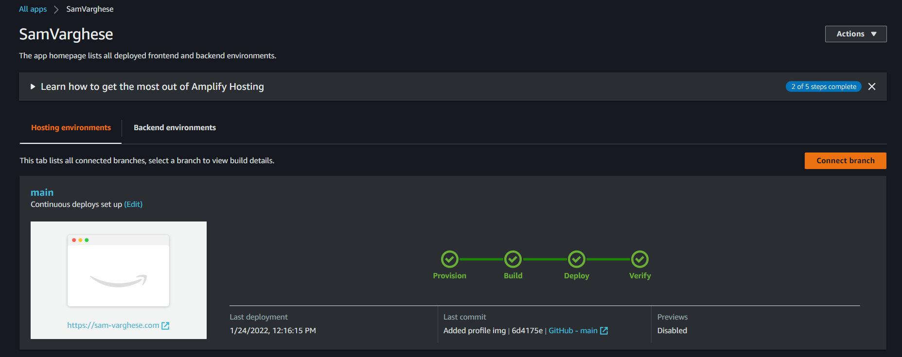
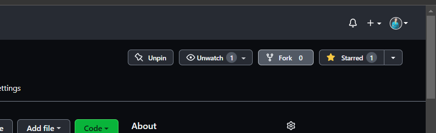
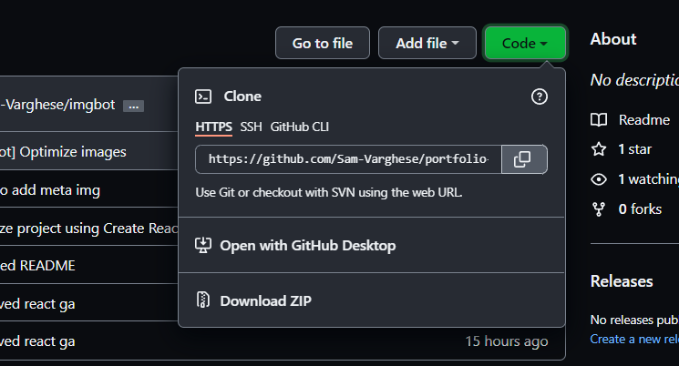

# Portfolio, Sam Varghese

Hey folks this is the repository containing the source code of [my portfolio](sam-varghese.com). Here are the technologies used in order to develop this portfolio:

- [React JS](https://reactjs.org/)
- [Sass](https://sass-lang.com/)
- [AWS](https://aws.amazon.com/)
- [AWS Route 53](https://aws.amazon.com/route53/)
- [AWS Amplify](https://aws.amazon.com/amplify/)

This repository is connected with [AWS Amplify](https://aws.amazon.com/amplify/). So every time I push a code, continuous deployment takes place, and [sam-varghese.com](sam-varghese.com) automatically gets updated with the pushed code.

# Run locally

In order to run this application locally, follow these steps

1. Firstly fork the repository

2. Now copy the link to clone the forked repository

3. Now open terminal in a work space and run the command `git clone <link>` (Replace `<link>` with the link you copied after forking the repository)
4. Now move to the cloned repository (Change directory). Execute the command `cd portfolio-SamVarghese`
5. Now in order to run the application, execute the command `npm start`
6. This will initialize the application and open [http://localhost:3000/](http://localhost:3000/) automatically.