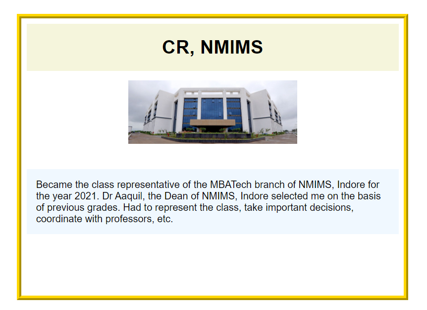

# Achievement Component

This folder contains [achievementsComponent.js](achievementsComponent.js) and [achievementsComponent.scss](achievementsComponents.scss) which are responsible to display all individual components to put the achievements section.

