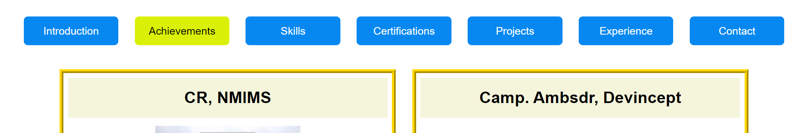

# Menu

This folder contains [menu.js](menu.js) and [menu.scss](menu.scss) which are responsible to display the menu of my portfolio.

In order to differentiate the menu item which is currently active from others, I've made a function namely `renderMenuItem` which takes a `prop` and get the information of the web-page user has currently opened, and thus differentiates the active menu item from the rest one.